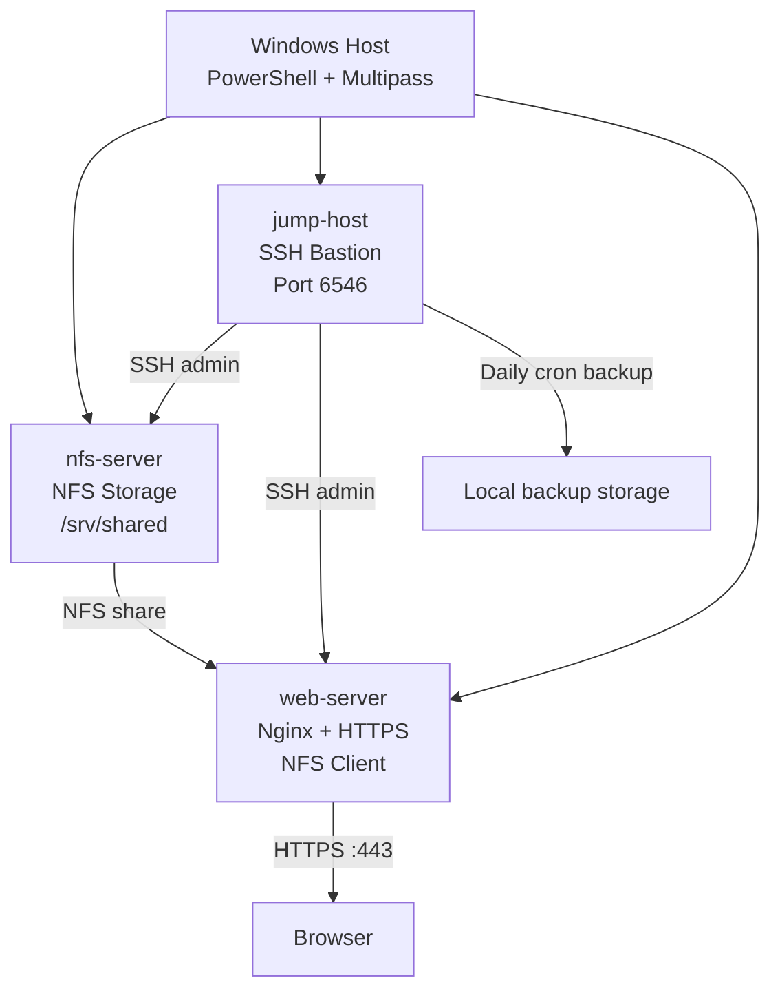

# Linux Infrastructure Automation Lab


Automated deployment of a 3-node Linux infrastructure — NFS shared storage, an SSH bastion host, and an Nginx/HTTPS web server — provisioned on a Windows host with Multipass, PowerShell, and Bash.

## Overview

This is a hands-on infrastructure lab, not an application. The goal was to automate the full lifecycle of a small multi-server Linux environment instead of clicking through each VM by hand:

- Virtual machine provisioning (Multipass)
- PowerShell automation on the Windows host
- Bash automation on each Linux VM
- SSH key-based authentication and SSH hardening
- UFW firewall configuration
- NFS shared storage between servers
- Nginx web hosting with a self-signed TLS certificate
- Cron-based scheduled backups

Everything here is reproducible from the scripts in `Scripts/` — no server was configured by hand.

## Architecture



| Server | Role |
|---|---|
| `nfs-server` | Central NFS storage and application file repository |
| `jump-host` | SSH bastion / administration point and backup controller |
| `web-server` | NFS client and public-facing Nginx HTTPS server |

## Repository Structure

```
linux-infrastructure-automation/
├── Configs/
│   ├── Inventory/
│   │   └── all-ips.example
│   ├── NFS/
│   │   └── exports
│   ├── Nginx/
│   │   └── default.conf
│   └── SSH/
│       └── sshd_config
├── Screenshots/
│   ├── 1-powershell-scripts/
│   ├── 2-nfs-server/
│   ├── 3-jump-host-server/
│   └── 4-web-server/
├── Scripts/
│   ├── Bash/
│   │   ├── 02-nfs-server-setup.sh
│   │   ├── 03-jump-host-setup.sh
│   │   └── 05-web-server-setup.sh
│   └── Powershell/
│       ├── 01-launch-all-vms.ps1
│       └── 04-distribute-jump-key.ps1
├── Website/
│   └── test_site.html
├── .gitattributes
├── LICENSE
└── README.md
```

## Getting Started

**Prerequisites**

- Windows with [Multipass](https://multipass.run/) installed
- PowerShell
- An `ed25519` SSH keypair on the host (`ssh-keygen -t ed25519`)

**Run order**

1. **Launch the VMs** — from a Windows PowerShell terminal:
   ```powershell
   Scripts/Powershell/01-launch-all-vms.ps1
   ```
   Creates all three VMs and distributes your SSH key to them.

2. **Set up nfs-server** — open a shell into the VM and run the script from inside it:
   ```
   multipass shell nfs-server
   nano 02-nfs-server-setup.sh      # paste in the script, then Ctrl+O, Enter, Ctrl+X to save
   chmod +x 02-nfs-server-setup.sh
   ./02-nfs-server-setup.sh
   ```

3. **Set up jump-host** — same pattern, inside `jump-host`:
   ```
   multipass shell jump-host
   nano 03-jump-host-setup.sh
   chmod +x 03-jump-host-setup.sh
   ./03-jump-host-setup.sh
   ```

4. **Distribute jump-host's key** — back on Windows, in PowerShell:
   ```powershell
   Scripts/Powershell/04-distribute-jump-key.ps1
   ```
   Pulls jump-host's public key and installs it on nfs-server and web-server.

5. **Set up web-server** — same pattern, inside `web-server`:
   ```
   multipass shell web-server
   nano 05-web-server-setup.sh
   chmod +x 05-web-server-setup.sh
   ./05-web-server-setup.sh
   ```

That's the full deployment — five steps, nothing configured by hand outside these scripts. `multipass shell` is used to get each script onto its VM because it works regardless of the VM's SSH state — unlike a raw `ssh`/`scp` call, it doesn't care that nfs-server and jump-host are already hardened to port `6546` by the time you reach them.

## How It Works

**SSH hardening.** Every VM ends up with SSH on port `6546`, `PermitRootLogin no`, and `PasswordAuthentication no` — access is key-based only. The scripts also create `admins`/`devs` groups and validate the config with `sudo sshd -t` before applying it, so a bad config can't lock a VM out silently.

**Firewall.** UFW is enabled on each server, allowing only the traffic that server actually needs (SSH, HTTP, HTTPS, NFS as relevant).

**NFS shared storage.** `nfs-server` exports `/srv/shared` to the local subnet. Application files live under `/srv/shared/apps/`; `web-server` mounts the same share at `/mnt/shared`, so both machines see the same files without copying anything between them.

**Web server.** `web-server` runs Nginx, mounts the NFS share, and serves the shared page from `/var/www/html/index.html`.

**HTTPS.** A self-signed certificate is generated with OpenSSL. Nginx listens on `443` and redirects HTTP to HTTPS — browsers will show a trust warning since it's self-signed, which is expected for a local lab.

**Backups.** `jump-host` runs a daily cron job at 12:00 PM that archives the shared storage into a dated folder, e.g. `~/backup/2026-09-26/shared.tar.gz`, using nothing more than `cron`, `tar`, and `date`.

## Technologies Used

| Technology | Purpose |
|---|---|
| Ubuntu | Server operating system |
| Multipass | VM provisioning |
| PowerShell | Windows-side orchestration |
| Bash | Linux automation |
| OpenSSH | Secure remote administration |
| UFW | Host firewall |
| NFS | Shared network storage |
| Nginx | Web server |
| OpenSSL | TLS certificate generation |
| Cron | Scheduled automation |
| Git / GitHub | Version control and documentation |

## Screenshots

`Screenshots/` documents the build step by step, organized by stage:

- `1-powershell-scripts/` — running `01-launch-all-vms.ps1` and `04-distribute-jump-key.ps1`
- `2-nfs-server/` — nfs-server before and after setup
- `3-jump-host-server/` — jump-host before/after setup, plus jump-host SSHing into nfs-server and web-server
- `4-web-server/` — web-server before/after setup and HTTPS working in the browser

## Challenges Along the Way

A few of the real problems worked through during this build:

- **`ssh` vs `sshd`** — early on, mixed up the client command with the daemon/service actually being configured, which cost time chasing the wrong config file.
- **Locked out of a VM by running scripts out of order** — miscounted the pipeline once and hardened a server before jump-host's key had actually been distributed to it, which briefly cut off direct access to that VM.
- **A long list of syntax errors** — in both the PowerShell and Bash scripts, small typos and quoting mistakes needed real troubleshooting, not just re-reading, to actually track down.
- **`Permission denied` writing to `/srv/shared`** — the export looked correct but still refused writes from the client; the fix came down to the export and directory permissions not actually lining up.

## Lessons Learned

- Designing and wiring together a multi-node Linux environment, not just single machines
- Passing configuration (IPs, keys) between machines automatically instead of by hand
- SSH key-based auth and service hardening, validated before it's applied
- Linux firewall management, NFS server/client setup, and Nginx + TLS configuration
- Scheduled maintenance with cron
- Troubleshooting real networking and permissions issues as they came up
- How several Linux services actually interact, rather than treating each as an isolated command

## Security Notes

This repo is an educational lab and does **not** contain:

- Private SSH keys
- Passwords, API tokens, or credentials
- Machine-specific config (real IPs, etc.)

Anything environment-specific ships as an example file instead — e.g. `Configs/Inventory/all-ips.example` shows the expected format without the real, generated `all-ips` file ever being committed.

## Author

**Karim Salah Hamane (KsHamane)**
Student at ENSTTIC, Oran, Algeria

[LinkedIn](https://www.linkedin.com/in/karim-salah-hamane) · [GitHub](https://github.com/KsHamane)

Designed, implemented, tested, and documented as a hands-on infrastructure automation project.

## License

MIT — see [LICENSE](LICENSE) for details.
